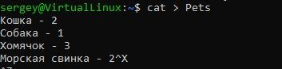
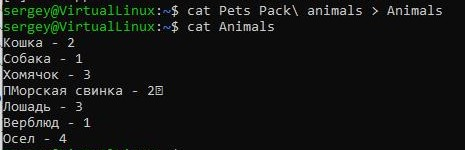
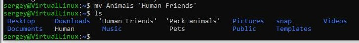
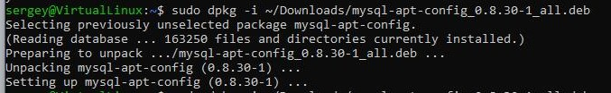
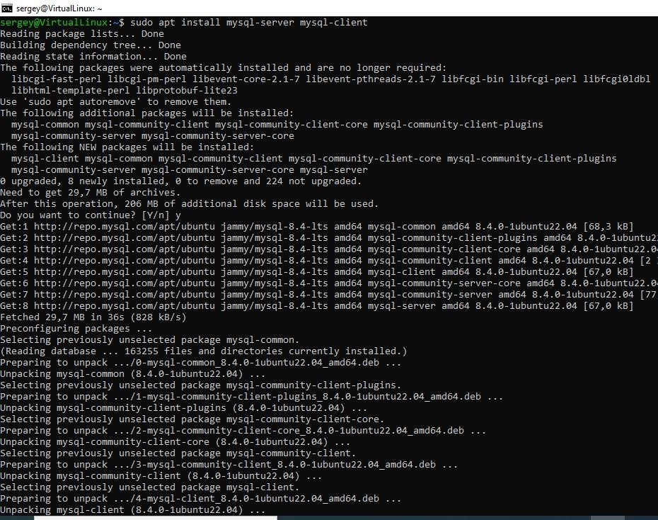
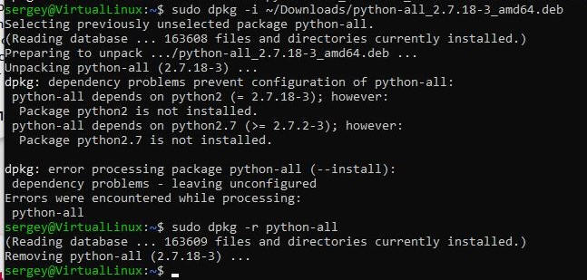
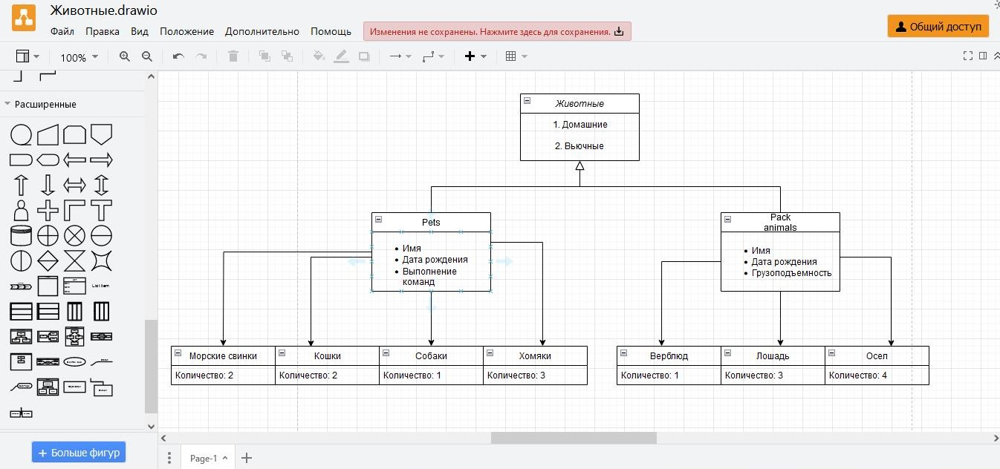

Итоговая контрольная работа

 Информация о проекте
 Необходимо организовать систему учета для питомника в котором живут домашние и Pack animals. 

Операционные системы и виртуализация (Linux)

1. Использование команды cat в Linux
   - Создать два текстовых файла: "Pets"(Домашние животные) 
cat > Pets
Кошка - 2
Собака - 1
Хомячок - 3
Морская свинка – 2

"Pack animals"(вьючные животные), 
cat > "Pack animals"
Лошадь - 3
Верблюд - 1
Осел – 4

   - Объединить содержимое этих двух файлов в один и просмотреть его содержимое.

   - Переименовать получившийся файл в "Human Friends"
“mv Animals 'Human Friends'”
Пример конечного вывода после команды “ls” :

2. Работа с директориями в Linux
   - Создать новую директорию и переместить туда файл "Human Friends".
 (5Директория Human Friends.jpg)
3. Работа с MySQL в Linux. “Установить MySQL на вашу вычислительную машину ”
   - Подключить дополнительный репозиторий MySQL и установить один из пакетов из этого репозитория.
Скачал файл mysql-apt-config_0.8.30-1_all.deb.
Затем, установил и настроил MySQL на вычислительную машину.
sudo dpkg -i ~/Downloads/mysql-apt-config_0.8.30-1_all.deb
sudo apt install mysql-server mysql-client
 
 
 
4. Управление deb-пакетами
   - Установить и затем удалить deb-пакет, используя команду `dpkg`.
Скачал файл python-all_2.7.18-3_amd64.deb
Установить - sudo dpkg -i ~/Downloads/python-all_2.7.18-3_amd64.deb
Удалить - sudo dpkg -r python-all
 

5. Диаграмма классов
   - Создать диаграмму классов с родительским классом "Животные", и двумя подклассами: "Pets" и "Pack animals".
В составы классов которых в случае Pets войдут классы: собаки, кошки, хомяки, а в класс Pack animals войдут: Лошади, верблюды и ослы.
Каждый тип животных будет характеризоваться (например, имена, даты рождения, выполняемые команды и т.д)
 
